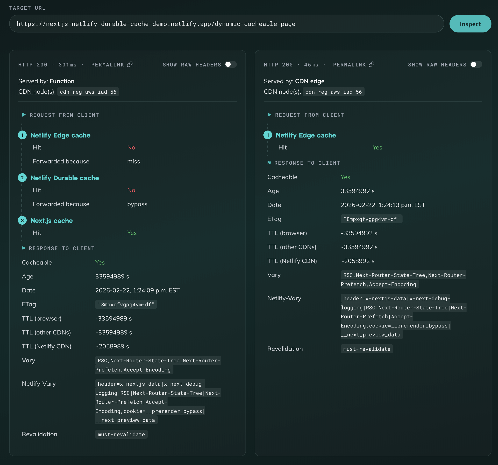

# Netlify Cache Inspector

A web app for inspecting and comparing caching behaviour on live Netlify sites.

Submit a URL and the app fetches it with Netlify's debug headers enabled, then displays a structured breakdown of the caching behavior: which cache layers were hit, cache-control directives, TTLs, and more. Run the same URL multiple times and compare results side-by-side with interactive hover-based diffing.



## Getting started

Requires Node.js >= 20 and pnpm (enable via `corepack enable`).

```sh
pnpm install
pnpm run dev
```

The dev server starts at http://localhost:3000 if port is 3000 is available.

## How it works

1. You enter a Netlify-hosted URL
2. The server fetches it and extracts cache-relevant response headers
3. Headers are parsed into a structured breakdown:
   - **Cache status** per layer (edge, durable cache, origin frameworks)
   - **Cache-control** directives with TTL calculations
   - **Served-by** detection (CDN edge, durable cache, function, edge function)
4. Results are persisted so runs can be shared via permalink

## Deployment

This site deploys automatically to Netlify.

## Tech stack

- [Nuxt 4](https://nuxt.com) (Vue 3, file-based routing, server API routes)
- [UnoCSS](https://unocss.dev) (utility CSS, dark mode, custom theme)
- [Netlify Blobs](https://docs.netlify.com/blobs/overview/) (run persistence)
- [Vitest](https://vitest.dev) + [Vue Test Utils](https://test-utils.vuejs.org) (testing)

## Contributing

You are absolutely welcome to contribute!

See [CONTRIBUTING.md](./CONTRIBUTING.md) for development workflow, testing, and code conventions.

## Architecture

See [ARCHITECTURE.md](./ARCHITECTURE.md) for project structure, data flow, and key design decisions.
